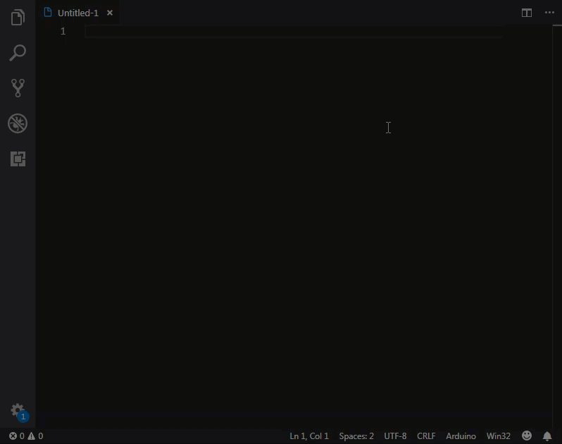

# Arduino snippets for VS Code

This extension for Visual Studio Code adds snippets for Arduino.  
Adds arduino snippets for both `*.ino` files and `cpp` language. So, if you didn't install [Microsoft's Arduino extension](https://marketplace.visualstudio.com/items?itemName=vsciot-vscode.vscode-arduino), the snippets would still work.

## Usage

Type part of a snippet, press `enter`, and the snippet unfolds.

### Snippets

| Snippet              | Purpose                       |
| -------------------- | ------------------------------|
| Advanced I/O   |
| `noTone`             | [noTone()](https://www.arduino.cc/reference/en/language/functions/advanced-io/notone/)                  |
| `pulseIn`            | [pulseIn()](https://www.arduino.cc/reference/en/language/functions/advanced-io/pulsein/)                 |
| `pulseInLong`        | [pulseInLong()](https://www.arduino.cc/reference/en/language/functions/advanced-io/pulseinlong/)       |
| `shiftIn`            | [shiftIn()](https://www.arduino.cc/reference/en/language/functions/advanced-io/shiftin/)                 |
| `shiftOut`           | [shiftOut()](https://www.arduino.cc/reference/en/language/functions/advanced-io/shiftout/)                |
| `tone`               | [tone()](https://www.arduino.cc/reference/en/language/functions/advanced-io/tone/)                    |
| Analog I/O   |
| `analogRead`         | [analogRead](https://www.arduino.cc/reference/en/language/functions/analog-io/analogread/)                |
| `analogReference`    | [analogReference](https://www.arduino.cc/reference/en/language/functions/analog-io/analogreference/)           |
| `analogWrite`        | [analogWrite](https://www.arduino.cc/reference/en/language/functions/analog-io/analogwrite/)               |
| Bits and Bytes   |
| `bit`                | [bit()](https://www.arduino.cc/reference/en/language/functions/bits-and-bytes/bit/)                  |
| `bitClear`           | [bitClear()](https://www.arduino.cc/reference/en/language/functions/bits-and-bytes/bitclear/)                  |
| `bitRead`            | [bitRead()](https://www.arduino.cc/reference/en/language/functions/bits-and-bytes/bitread/)                  |
| `bitSet`             | [bitSet()](https://www.arduino.cc/reference/en/language/functions/bits-and-bytes/bitset/)                  |
| `bitWrite`           | [bitWrite()](https://www.arduino.cc/reference/en/language/functions/bits-and-bytes/bitwrite/)                  |
| `highByte`           | [highByte()](https://www.arduino.cc/reference/en/language/functions/bits-and-bytes/highbyte/)                  |
| `lowByte`            | [lowByte()](https://www.arduino.cc/reference/en/language/functions/bits-and-bytes/lowbyte/)                  |
| Characters   |
| `isAlpha`            | [isAlpha()](https://www.arduino.cc/reference/en/language/functions/characters/isalpha/)                  |
| `isAlphaNumeric`     | [isAlphaNumeric()](https://www.arduino.cc/reference/en/language/functions/characters/isalphanumeric/)                  |
| `isAscii`            | [isAscii()](https://www.arduino.cc/reference/en/language/functions/characters/isascii/)                  |
| `isControl`          | [isControl()](https://www.arduino.cc/reference/en/language/functions/characters/iscontrol/)                  |
| `isDigit`            | [isDigit()](https://www.arduino.cc/reference/en/language/functions/characters/isdigit/)                  |
| `isGraph`            | [isGraph()](https://www.arduino.cc/reference/en/language/functions/characters/isgraph/)                  |
| `isHexadecimalDigit` | [isHexadecimalDigit()](https://www.arduino.cc/reference/en/language/functions/characters/ishexadecimaldigit/)                  |
| `isLowerCase`        | [isLowerCase()](https://www.arduino.cc/reference/en/language/functions/characters/islowercase/)                  |
| `isPrintable`        | [isPrintable()](https://www.arduino.cc/reference/en/language/functions/characters/isprintable/)                  |
| `isPunct`            | [isPunct()](https://www.arduino.cc/reference/en/language/functions/characters/ispunct/)                  |
| `isSpace`            | [isSpace()](https://www.arduino.cc/reference/en/language/functions/characters/isspace/)                  |
| `isUpperCase`        | [isUpperCase()](https://www.arduino.cc/reference/en/language/functions/characters/isuppercase/)                  |
| `isWhitespace`       | [isWhitespace()](https://www.arduino.cc/reference/en/language/functions/characters/iswhitespace/)                  |
| Communication   |
| `savailable`         | [Serial.available()](https://www.arduino.cc/reference/en/language/functions/communication/serial/available)        |
| `sbegin`             | [Serial.begin()](https://www.arduino.cc/reference/en/language/functions/communication/serial/begin)            |
| `send`               | [Serial.end()](https://www.arduino.cc/reference/en/language/functions/communication/serial/end)              |
| `sevent`             | [serialEvent()](https://www.arduino.cc/reference/en/language/functions/communication/serial/serialevent)             |
| `sfind`              | [Serial.find()](https://www.arduino.cc/reference/en/language/functions/communication/serial/find)             |
| `sfindUntil`         | [Serial.findUntil()](https://www.arduino.cc/reference/en/language/functions/communication/serial/finduntil)        |
| `sflush`             | [Serial.flush()](https://www.arduino.cc/reference/en/language/functions/communication/serial/flush)            |
| `spfloat`            | [Serial.parseFloat()](https://www.arduino.cc/reference/en/language/functions/communication/serial/parsefloat)       |
| `spint`              | [Serial.parseInt()](https://www.arduino.cc/reference/en/language/functions/communication/serial/println)         |
| `speek`              | [Serial.peek()](https://www.arduino.cc/reference/en/language/functions/communication/serial/peek)             |
| `sprint`             | [Serial.print()](https://www.arduino.cc/reference/en/language/functions/communication/serial/print)            |
| `sprint`             | [Serial.println()](https://www.arduino.cc/reference/en/language/functions/communication/serial/print)          |
| `sread`              | [Serial.read()](https://www.arduino.cc/reference/en/language/functions/communication/serial/read)             |
| `sreadBytes`         | [Serial.readBytes()](https://www.arduino.cc/reference/en/language/functions/communication/serial/readbytes)        |
| `sreadBytesUntil`    | [Serial.readBytesUntil()](https://www.arduino.cc/reference/en/language/functions/communication/serial/readbytesuntil)   |
| `stimeout`           | [Serial.setTimeout()](https://www.arduino.cc/reference/en/language/functions/communication/serial/settimeout)       |
| `swrite`             | [Serial.write()](https://www.arduino.cc/reference/en/language/functions/communication/serial/write)            |
| Data Types    |
| `byte`               | [byte()](https://www.arduino.cc/reference/en/language/variables/conversion/bytecast/)                    |
| `char`               | [char()](https://www.arduino.cc/reference/en/language/variables/conversion/charcast/)                    |
| `float`              | [float()](https://www.arduino.cc/reference/en/language/variables/conversion/floatcast/)                   |
| `ifdef`              | [Macro ifdef]( )               |
| `ifndef`             | [Macro ifndef]( )              |
| `int`                | [int()](https://www.arduino.cc/reference/en/language/variables/conversion/intcast/)                     |
| `long`               | [long()](https://www.arduino.cc/reference/en/language/variables/conversion/longcast/)                    |
| `elif`               | [Macro elif]( )                |
| `sizeof`             | [sizeof()](https://www.arduino.cc/reference/en/language/variables/utilities/sizeof/)                  |
| `undef`              | [Macro undef]( )               |
| Digital I/O   |
| `digitalRead`        | [digitalRead](https://www.arduino.cc/reference/en/language/functions/digital-io/digitalread/)               |
| `digitalWrite`       | [digitalWrite](https://www.arduino.cc/reference/en/language/functions/digital-io/digitalwrite/)              |
| `pinMode`            | [pinMode](https://www.arduino.cc/reference/en/language/functions/digital-io/pinmode/)                   |
| External Interrupts   |
| `attachInterrupt`    | [attachInterrupt()](https://www.arduino.cc/reference/en/language/functions/external-interrupts/attachinterrupt/)         |
| `detachInterrupt`    | [detachInterrupt()](https://www.arduino.cc/reference/en/language/functions/external-interrupts/detachinterrupt/)         |
| Interrupts   |
| `interrupts`         | [interrupts()](https://www.arduino.cc/reference/en/language/functions/interrupts/interrupts/)                     |
| `noInterrupts`       | [noInterrupts()]https://www.arduino.cc/reference/en/language/functions/interrupts/nointerrupts/)                     |
| Math   |
| `abs`                | [abs()](https://www.arduino.cc/reference/en/language/functions/math/abs/)                     |
| `constrain`          | [constrain()](https://www.arduino.cc/reference/en/language/functions/math/constrain/)               |
| `map`                | [map()](https://www.arduino.cc/reference/en/language/functions/math/map/)                     |
| `max`                | [max()](https://www.arduino.cc/reference/en/language/functions/math/max/)                     |
| `min`                | [min()](https://www.arduino.cc/reference/en/language/functions/math/min/)                     |
| `pow`                | [pow()](https://www.arduino.cc/reference/en/language/functions/math/pow/)                     |
| `sq`                 | [sq()](https://www.arduino.cc/reference/en/language/functions/math/sq/)                    |
| `sqrt`               | [sqrt()](https://www.arduino.cc/reference/en/language/functions/math/sqrt/)                    |
| Random Numbers   |
| `random`             | [random()](https://www.arduino.cc/reference/en/language/functions/random-numbers/random/)                  |
| `randomSeed`         | [randomSeed()](https://www.arduino.cc/reference/en/language/functions/random-numbers/randomseed/)              |
| Resolution   |
| `areadresolution`    | [analogReadResolution()](https://www.arduino.cc/reference/en/language/functions/zero-due-mkr-family/analogreadresolution/)     |
| `awriteresolution`   | [analogWriteResolution()](https://www.arduino.cc/reference/en/language/functions/zero-due-mkr-family/analogwriteresolution/)    |
| String Fucionts    |
| `c_str`              | [c_str()](https://www.arduino.cc/reference/en/language/variables/data-types/string/functions/c_str/)                   |
| `charAt`             | [charAt()](https://www.arduino.cc/reference/en/language/variables/data-types/string/functions/charat/)                   |
| `compareTo`          | [compareTo()](https://www.arduino.cc/reference/en/language/variables/data-types/string/functions/compareto/)                   |
| `concat`             | [concat()](https://www.arduino.cc/reference/en/language/variables/data-types/string/functions/concat/)                   |
| `endsWith`           | [endsWith()](https://www.arduino.cc/reference/en/language/variables/data-types/string/functions/endswith/)                   |
| `equals`             | [equals()](https://www.arduino.cc/reference/en/language/variables/data-types/string/functions/equals/)                   |
| `equalsIgnoreCase`   | [equalsIgnoreCase()](https://www.arduino.cc/reference/en/language/variables/data-types/string/functions/equalsignorecase/)     |
| `getBytes`           | [getBytes()](https://www.arduino.cc/reference/en/language/variables/data-types/string/functions/getbytes/)                   |
| `indexOf`            | [indexOf()](https://www.arduino.cc/reference/en/language/variables/data-types/string/functions/indexof/)                   |
| `lastIndexOf`        | [lastIndexOf()](https://www.arduino.cc/reference/en/language/variables/data-types/string/functions/lastindexof/)              |
| `length`             | [length()](https://www.arduino.cc/reference/en/language/variables/data-types/string/functions/length/)                   |
| `remove`             | [remove()](https://www.arduino.cc/reference/en/language/variables/data-types/string/functions/remove/)                   |
| `replace`            | [replace()](https://www.arduino.cc/reference/en/language/variables/data-types/string/functions/replace/)                   |
| `reserve`            | [reserve()](https://www.arduino.cc/reference/en/language/variables/data-types/string/functions/reserve/)                   |
| `setCharAt`          | [setCharAt()](https://www.arduino.cc/reference/en/language/variables/data-types/string/functions/setcharat/)                   |
| `startsWith`         | [startsWith()](https://www.arduino.cc/reference/en/language/variables/data-types/string/functions/startswith/)                |
| `substring`          | [substring()](https://www.arduino.cc/reference/en/language/variables/data-types/string/functions/substring/)                   |
| `toCharArray`        | [toCharArray()](https://www.arduino.cc/reference/en/language/variables/data-types/string/functions/tochararray/)               |
| `toFloat`            | [toFloat()](https://www.arduino.cc/reference/en/language/variables/data-types/string/functions/tofloat/)                   |
| `toInt`              | [toInt()](https://www.arduino.cc/reference/en/language/variables/data-types/string/functions/toint/)                   |
| `toLowerCase`        | [toLowerCase()](https://www.arduino.cc/reference/en/language/variables/data-types/string/functions/tolowercase/)               |
| `toUpperCase`        | [toUpperCase()](https://www.arduino.cc/reference/en/language/variables/data-types/string/functions/touppercase/)               |
| `trim`               | [trim()](https://www.arduino.cc/reference/en/language/variables/data-types/string/functions/trim/)                   |
| Structure |
| `arduino`            | [skelet](https://www.arduino.cc/reference/en/)                    |
| `class`              | [skelet](https://www.arduino.cc/en/Hacking/LibraryTutorial)                    |
| `define`             | [Macro define](https://www.arduino.cc/reference/en/language/structure/further-syntax/define/)              |
| `dowhile`            | [do-while](https://www.arduino.cc/reference/en/language/structure/control-structure/dowhile/)                  |
| `if`                 | [Macro if](https://www.arduino.cc/reference/en/language/structure/control-structure/if/)                  |
| `include`            | [include syslib](https://www.arduino.cc/reference/en/language/structure/further-syntax/include/)            |
| `for`                | [for](https://www.arduino.cc/reference/en/language/structure/control-structure/for/)                       |
| `loop`               | [loop](https://www.arduino.cc/reference/en/language/structure/sketch/loop/)                      |
| `setup`              | [setup](https://www.arduino.cc/reference/en/language/structure/sketch/setup/)                     |
| `struct`             | [skelet](https://playground.arduino.cc/Code/Struct)                    |
| `switch`             | [switch](https://www.arduino.cc/reference/en/language/structure/control-structure/switchcase/)                    |
| `while`              | [while](https://www.arduino.cc/reference/en/language/structure/control-structure/while/)                     |
| Time   |
| `delay`              | [delay()](https://www.arduino.cc/reference/en/language/functions/time/delay/)                   |
| `delayMicroseconds`  | [delayMicroseconds()](https://www.arduino.cc/reference/en/language/functions/time/delaymicroseconds/)       |
| `micros`             | [micros()](https://www.arduino.cc/reference/en/language/functions/time/micros/)                  |
| `millis`             | [millis()](https://www.arduino.cc/reference/en/language/functions/time/millis/)                  |
| Trigonometry   |
| `cos`                | [cos()](https://www.arduino.cc/reference/en/language/functions/trigonometry/cos/)                  |
| `sin`                | [sin()](https://www.arduino.cc/reference/en/language/functions/trigonometry/sin/)                  |
| `tan`                | [tan()](https://www.arduino.cc/reference/en/language/functions/trigonometry/tan/)                  |
